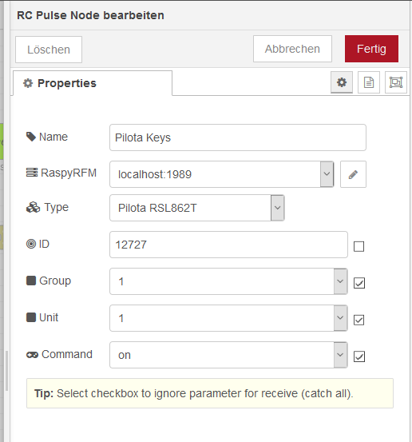
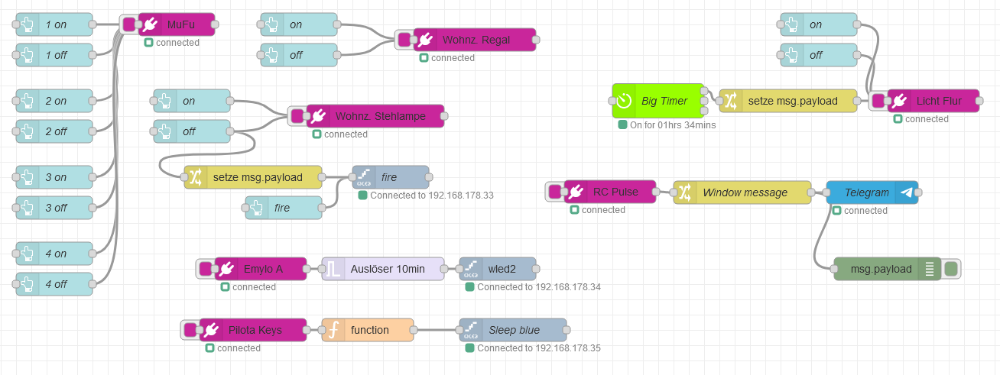

# Node-RED support for sending and receiving with [RaspyRFM] radio module
## Nodes
### RC pulse

     Node for sending & receiving RC codes. Control RC sockets and receive buttons and sensors. Supports intertechno, logilight, brennenstuhl, emylo & many others
All settings are configurable in node's properties. The settings can optionally be overridden using msg.payload as an object.

## Installation
    npm install node-red-contrib-raspyrfm

## Supported devices
* Intertechno (old tristate and newer 32 bit) sockets & remote controls
* Hama sockets & remote controls
* Brennenstuhl RCS1000 sockets & remote controls
* Logilight sockets & remote controls
* Pilota casa sockets & remote controls
* Emylo sockets & remote controls
* ELV FS20 sockets & remote controls
* Voltcraft RC30 sockets & remote controls

## Operation
On a raspberry PI, connect the [RaspyRFM] radio module, follow the installation instructions and run:
    ./rcpulsegw.py
In Node-RED draw RC pulse node on your flow and configure.

Example:
* RC Pulse node "MuFu" controls 4 RC sockets trigger by UI buttons
* Big Timer controlling RC pulse node "Licht Flur", switching on lights at dusk, off at dawn
* RC Pulse node "RC Pulse" sending a message to Telegram when a button on the RC remote is pressed
* RC Pulse node "Emylo A" switching on a WLED device for 10 minutes after button is pressed 

[RaspyRFM]:http://www.seegel-systeme.de/2015/09/02/ein-funkmodul-fuer-den-raspberry-raspyrfm/